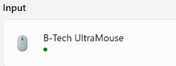

# ESP32-mousemover

This is my first public ESP32 project. It compiles on PlatformIO and uses a [ESP32-S3-Zero](https://www.waveshare.com/wiki/ESP32-S3-Zero) as hardware.


I hear you saying *"you could simply disable your screensaver"*. Correct. But I was tired to change the settings every time Microsoft, HP or whoever decided that my laptop had to be a bit "greener". And so I coded this device which is connected to my docking station. Problem solved. :wink:

# Releases

## 1.2

OTA updates now supported

## 1.1

Identification of Mouse Mover can be configured

## 1.0

First release

# Known issues & ideas for later

* The onboard (RGB) LED, connected to GPIO 21, doesn't blink as intended. Once I knew how to let it blink in all colors - but somehow lost the code and didn't quickly find a working example on the Internet.
* Today, my "mouse" device identifies as "Espressif ESP32-S3-USB-OTG". Idea is to change the name so that it looks more like a real mouse.

# Compile Parameters

## TEST

By default, the mouse pointer is moved by nealy-invisible 2pt every 270 seconds. Compiling the code with option -D TEST will

* increase the distance of the mouse motion so that the effect can better be observed. 
* reduces the move-interval from 270 to just a few seconds so that it moves more often.

## USB_DISABLED

For debugging only, disables USB mode completely and provides "serial" console for debugging other code

## LED_BUILTIN

If set to a GPIO Pin, the idea is that the onboard LED will blink when the mouse pointer is moved.

## RGB_BUILTIN

If set to a GPIO Pin, the idea is that the onboard LED will blink when the mouse pointer is moved. Current color is set to blue, but can be customized.

## OTA & OTA_PASSWORD

Enable Over-The-Air updates and - optionally - set a pasword to revent unauthorized updates.

## USB_PRODUCT + USB_MANUFACTURER

Both flags can be used to define the device name. By default, the mouse move will identify depending on the ESP 32 model. With the parameters in the platformio.ini file, it will identify as follows on Windows systems:



# OTA (Over The Air) Updates

## Provide your WiFi credentials and - optionally - an OTA update password

If you want to update your MouseMover via the air, you need to provide the WiFi credentials and an (optional) OTA password. in a file named "myWiFi_secrets.h"

Example:

```
#define WIFI_SSID     "yourSSID"
#define WIFI_PASSWORD "yourPassword"
#define OTA_PASSWORD  "yourOTAPassword"
```

## Ensure that your ESP is OTA prepared

For OTA updates, your ESP requires 

* an "otadata" partition
* at least 2 app partitions

To check the partition tables of your ESP, perform the following steps:

a) READ the partition table and write it to a file. Example:

```
.\esptool.exe -b 115200 --port COM4 read_flash  0x8000 0xC00 ESP_table.bin          
esptool.py v4.5.1
Serial port COM4
Connecting...
Detecting chip type... ESP32-S3
Chip is ESP32-S3 (revision v0.1)
Features: WiFi, BLE
Crystal is 40MHz
MAC: 24:ec:4a:26:5d:b0
Uploading stub...
Running stub...
Stub running...
3072 (100 %)
3072 (100 %)
Read 3072 bytes at 0x00008000 in 0.4 seconds (67.7 kbit/s)...
Hard resetting via RTS pin...
```


b) DECODE the partition table. Example:

```
.\gen_esp32part.exe .\ESP_table.bin       
Parsing binary partition input...
Verifying table...
# ESP-IDF Partition Table
# Name, Type, SubType, Offset, Size, Flags
nvs,data,nvs,0x9000,20K,
otadata,data,ota,0xe000,8K,
app0,app,ota_0,0x10000,1280K,
app1,app,ota_1,0x150000,1280K,
spiffs,data,spiffs,0x290000,1408K,
coredump,data,coredump,0x3f0000,64K,
```

## configure your ESP32's IP address in the platformio.ini

Once you have enabled OTA updates and uploaded your sketch via COM port to your ESP32, you can

* disable the "upload_prt=COM*" line
* enable the other "upload_*" lines as shown below

```
; ---------------------------------------------------------------------
; upload and monitoring settings
; ---------------------------------------------------------------------
upload_flags =
    --host_port=45678
    ;--port=8266   ; for ESP8266
    --port=3232    ; for ESP32
    --auth=${Secrets.OTAPW}
upload_protocol = espota
upload_port     = 192.168.1.120
;upload_port			            = COM4
```
